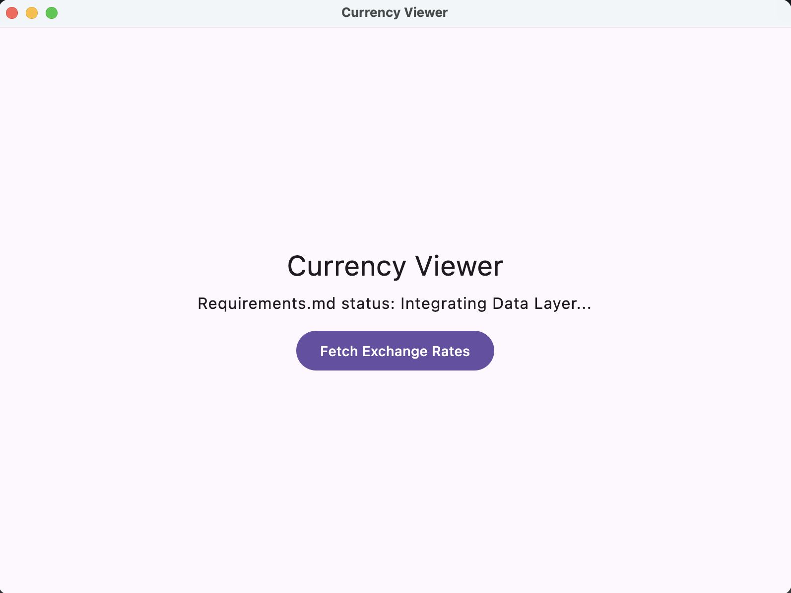
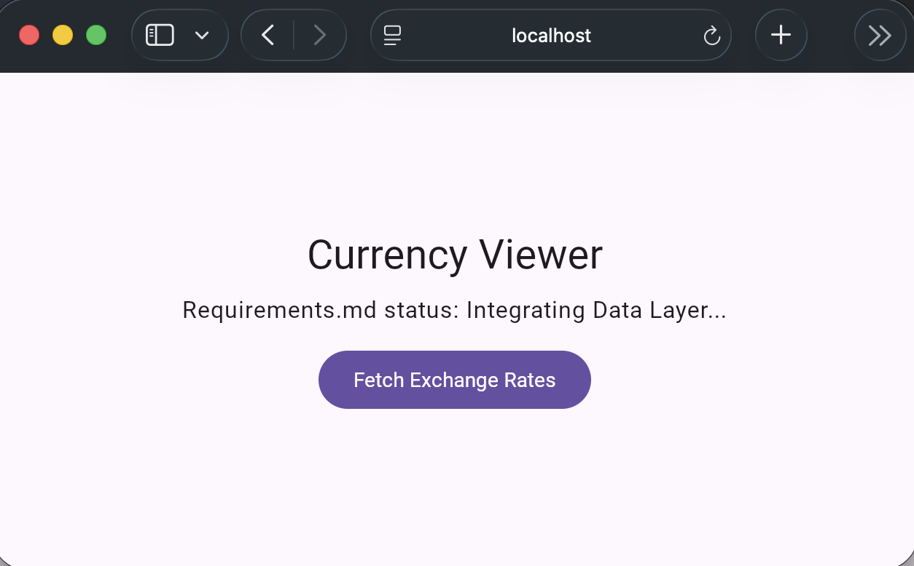

# CurrencyViewer

Kotlin Multiplatform + Compose Multiplatform 匯率檢視工具（Desktop + Web/Wasm）。

## Prerequisites

- JDK：Java 25（recommended distribution: Eclipse Temurin）
- Gradle：請一律用 Gradle Wrapper 執行指令（`./gradlew`），避免本機 Gradle 版本差異造成問題。
- 瀏覽器（Wasm）：建議使用 Chrome / Edge 最新版（開發模式用）

## Toolchain policy (SSOT)

This project intentionally moves forward with a newer toolchain baseline:

- Java 25
- Kotlin 2.3.x
- Gradle Wrapper 9.1.0

Note: Kotlin documents Gradle 9.0.0 as the maximum *fully supported* Gradle version for KGP 2.3.0, but newer Gradle versions may still work (with possible deprecation warnings or incomplete support).
Team policy: we accept this risk; CI pins versions, and any warnings should be tracked via issues instead of being ignored.

See ADR: `docs/decisions/ADR-0001-build-toolchain-policy.md`

## Build (Desktop + Wasm)

1. 檢查 Gradle 版本是否為 9.1.0

```bash
./gradlew --version
```
執行結果：
```text
------------------------------------------------------------
Gradle 9.1.0
------------------------------------------------------------
```

2. 更新 Gradle 為 9.1.0

```bash
./gradlew wrapper --gradle-version=9.1.0
````

3. 編譯

```bash
./gradlew clean
./gradlew build
```

## Running the App

### Running on Desktop (JVM / Compose Desktop)

1. Clone 專案並進入目錄
```bash
git clone https://github.com/neojou/CurrencyViewer.git
cd CurrencyViewer
```

2. 啟動 Desktop App

```bash
./gradlew :composeApp:desktopRun

```


### 預期結果：

會啟動 Compose Desktop 視窗，顯示目前的 Placeholder UI（T0.1 階段）。



### Troubleshooting（Desktop）：
- Java 版本不對或 JAVA_HOME 指到錯的 JDK：請確認使用 Java 25，並重新開啟終端機/IDE 後再試。

- Gradle 建置失敗（快取或依賴問題）：可嘗試 ./gradlew clean 後重跑，或在必要時加上 --refresh-dependencies。

- 公司網路/Proxy 導致依賴下載失敗：請檢查 Gradle 的 proxy 設定（~/.gradle/gradle.properties）與網路限制。

## Running on Web (Wasm / Browser development mode)

1. 啟動 Wasm 開發伺服器

```bash
./gradlew wasmJsBrowserDevelopmentRun
```
2. 開啟瀏覽器

- 指令執行後通常可在瀏覽器開啟（或手動開啟）http://localhost:8080/，看到 Placeholder UI。

### 預期結果：

- 瀏覽器顯示 Web/Wasm 版本的 Placeholder UI。



### Troubleshooting（Wasm）：

- Port 8080 被占用：實際 port 可能會改用其他可用的數字；請以 Gradle 輸出顯示的網址/port 為準。

- 連線/資料抓取失敗（CORS、離線、網路限制）：請開啟瀏覽器 DevTools（Console + Network）確認錯誤原因，並確認 API 在瀏覽器環境可存取（尤其是公司網路或代理設定）。

- 瀏覽器相容性：若畫面空白或 Wasm 載入異常，請優先改用 Chrome / Edge 最新版重試。


